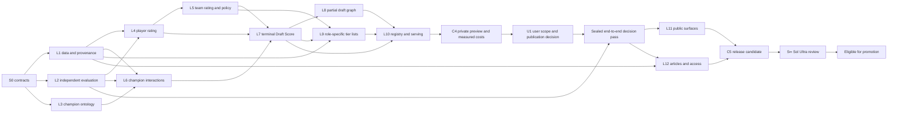

# Scryglass model v2 contract pack

Status: **binding design contract for the initial rebuild**
Contract version: `2.0.0`
Initial build excludes live in-game scoring.

This directory is the single source of truth for the mathematical rebuild. A
builder may choose an implementation detail only where this pack marks it as a
research choice. Where current code, artifacts, UI copy, or older methodology
disagrees with this pack, v2 wins and the disagreement is migration debt.

## Public promise

Scryglass publishes three primary numbers:

1. **Player Rating** — the posterior mean of a player's current, role-adjusted
   contribution in the visibly labeled league scope or bridged-global eligible
   player scope, shown on the 1500/400 Elo expected-result scale without adding
   League Rating to individual skill.
2. **Team Rating** — the posterior mean strength of the exact active five-player
   roster, on the same result-linked scale.
3. **Draft Score** — for a completed draft, an equal-strength composition index
   after removing baseline roster/league strength and in-game side advantage.
   It is not directly calibrated against outcomes from unequal real teams. A
   contextual map-win probability may be shown only after the independently
   validated ratings-plus-draft model passes its incremental, calibration, and
   reliability gates. A partial draft may use probability wording only in an
   independently approved prefix/policy stratum; otherwise it is an ordinal
   research view. Draft Score is currently withheld on the public surface.

Each number must carry an `as_of` time, a 95% interval where the estimand admits
one, input and model lineage, and a literal interpretation. No number may be
called state of the art merely because its model is modern. That wording is
permitted only after the candidate wins the registered benchmark suite under
the promotion rule in [evaluation-contract.md](evaluation-contract.md).

## Authoritative files

| File | Authority |
|---|---|
| [product-contract.md](product-contract.md) | Audiences, surfaces, labels, and forecast/hindsight rules |
| [estimands.md](estimands.md) | Literal meaning and conditioning set of every public number |
| [mathematical-contract.md](mathematical-contract.md) | Candidate model, equations, invariants, and sparsity hierarchy |
| [data-contract.md](data-contract.md) | IDs, times, rosters, patches, provenance, and publication rules |
| [evaluation-contract.md](evaluation-contract.md) | Holdouts, metrics, calibration, promotion, and rollback |
| [interface-contract.md](interface-contract.md) | Python, artifact, API, and TypeScript boundaries |
| [build-order.md](build-order.md) | L1–L12 waves, ownership, prerequisites, and remands |
| [acceptance-gates.md](acceptance-gates.md) | Auditable completion checklists |
| [research-register.md](research-register.md) | Questions that require empirical resolution |
| [sources.md](sources.md) | Primary-source basis and Scryglass-specific synthesis |
| [`contracts/`](contracts/) | Draft 2020-12 JSON Schemas |

Current implementation evidence is tracked separately from this binding design
contract. See [private-decision-readiness-2026-08-02.md](private-decision-readiness-2026-08-02.md)
for the latest private, non-authorizing checkpoint.

## Terms

- **As of**: the latest instant whose information may influence an artifact or
  prediction.
- **Forecast**: created from information available strictly before the event
  starts and then stored immutably.
- **Forecast simulation**: historical replay of what was available before an
  event; never presented as a forecast that was actually stored then.
- **State snapshot**: current/as-of rating or tier-list artifact with no future
  event-sealing claim.
- **Current analysis**: ad-hoc as-of analysis or sandbox result with no event
  forecast claim.
- **Hindsight**: a retrospective estimate allowed to use information learned
  after the event; never presented as a forecast.
- **Neutral draft**: a standardized map-win prediction from composition and
  any identifiable draft-order term, with no team or player identity and with
  baseline roster/league strength and in-game side advantage neutralized.
- **Contextual draft**: neutral draft plus identity-specific draft fit, after
  equalizing baseline roster and league strength and neutralizing in-game side
  advantage.
- **Exact active roster**: one active main-roster player for each of top, jungle,
  mid, bot, and support at `as_of`.
- **League Rating**: the cross-league bridge component on the rating scale. It
  is not a team's international history.
- **Tier-1 eligible**: belongs to a circuit whose teams can qualify for a
  designated international event under the registered competition taxonomy.
- **Evidence**: separate posterior displacement, precision, and source/context
  coverage diagnostics; not a game count, popularity measure, or correctness
  probability.
- **Predictive reliability**: out-of-sample calibration and interval behavior
  for the applicable validation stratum.
- **Settled**: strict greater-than-95% precision and stability at the empirical
  resolution, a sufficiently narrow interval, current eligibility, fresh
  complete inputs, and no material fallback/OOD state.
- **Fallback**: an explicit, versioned prior level. Silent substitution is
  prohibited.

## Scope and non-goals

The initial cycle includes authored methodology, data lineage, dynamic player
and exact-roster team ratings, League Rating, terminal and partial Draft Score,
role-specific league-patch tier lists, canonical serving, and public/private
access boundaries.

The initial cycle does **not** include:

- in-game or five-minute live win estimates; any future live phase requires a
  new contract and explicit user approval;
- any total-kills, market, wagering, or under/over output;
- the void-grubs 24% result or any derivative of it;
- causal claims about champion, player, or roster effects;
- a global rank for tier-2 or tier-3 teams;
- public raw credentials, private source payloads, or unapproved model weights;
- a second draft estimator maintained “for compatibility.”

Calendar year is the default public filter, not a forced January reset of
latent states. Carry-over behavior is selected and documented by validation.

## Dependency DAG

## Ownership map

| Owner | Sole responsibility |
|---|---|
| S0 | This contract pack and contract interpretation |
| L1 | Data contracts, provenance, publication matrix, snapshots |
| L2 | Independent evaluation and promotion evidence |
| L3 | Champion ontology and archetype priors |
| L4 | Dynamic Player Rating |
| L5 | Exact-roster Team Rating, League Rating, team policy |
| L6 | Champion, ally, enemy, and whole-composition interactions |
| L7 | Canonical terminal Draft Score and reconciled explanations |
| L8 | Partial-draft graph, flex, signed strategic-response adjustment, recommendations |
| L9 | Role-specific league-current-patch tier lists |
| L10 | Model registry, artifacts, APIs, TypeScript runtime |
| L11 | Public ratings, match explorer, sandbox, tier-list surfaces |
| L12 | Articles, authentication, access control, self-healing copy |

Ownership is exclusive for implementation files during the initial cycle.
Cross-owner schema changes require S0 review and a contract-version change.

## Binding migration decisions

V2 supersedes the current leaky calibration, fake holdouts, retrospective
“predictions,” side-swap failures, conflicting draft engines, heuristic
confidence, phase composites that are not probabilities, four-hour series
grouping, blue-signed margin updates, HBT/Dual Elo label confusion, league
effects labeled as team effects, incorrect interval/half-life labels, and
overbroad public artifacts.

There will be exactly one promoted estimator per output and version. Baselines
remain evaluators, never silent serving fallbacks.

## Current repository conflicts and migration posture

These existing paths are read-only baselines during the v2 build:

| Current path/behavior | Conflict with v2 |
|---|---|
| `lol_kills/ratings/hierarchical_bt.py` | Derived four-hour series key can split/merge series; local approximation and public uncertainty labels do not satisfy v2 coverage/settled rules |
| `lol_kills/ratings/dual_elo.py` | Blue-signed margin update is outcome-asymmetric; `mu_meta` is not an acceptable name/meaning for League Rating |
| `lol_kills/ratings/player_elo.py` | Fixed role weights and sequential updates are baselines, not learned team policy or a validated posterior model |
| `lol_kills/draft_score.py`, `lol_kills/draft_phase_score.py`, and browser draft code | Multiple score engines, legacy temperature fallback, side bonus, heuristic confidence, and non-probability composites violate the single-estimator and calibration contracts |
| `/api/draft-wr` and `/api/draft-sandbox` | Current request/response shapes cannot prove prediction time, exact roster context, equalized baseline strength, served-transform identity, or fail-closed contextual mode |
| `/api/v2/draft/score` | Canonical terminal contract route is present, but remains unavailable until independent L2 promotion and source gates pass |
| `lol_kills/draft_tierlist.py` and current tier-list artifacts | Hand-tuned weights/taxes, cross-scope waterfalls, and zero-play priors cannot define the role×league×current-patch played-only Tier Value |
| `lol_kills/export/pack_spec.py` and existing public packs | Existing allowlists and grubs artifacts predate the source-by-source publication matrix and are not inherited by v2 |
| Existing model artifacts | Scope/year, validation lineage, calibration identity, and public/private decisions are insufficient for promotion |

The working checkout already contains user-owned modified and untracked files.
V2 therefore builds in the isolated namespaces in
[build-order.md](build-order.md), with no in-place legacy repair or release
until the clean-worktree allowlist gate.
