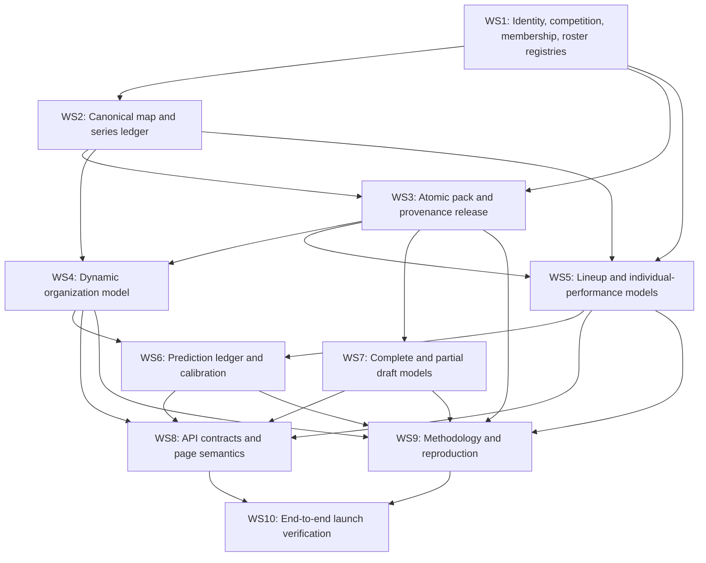

# Scryglass scientific rebuild workstreams

Version: 1.0
Date: 2026-07-26
Depends on: [`SCIENTIFIC_PRODUCT_ARCHITECTURE.md`](SCIENTIFIC_PRODUCT_ARCHITECTURE.md)
and
[`APP_WIDE_SCIENTIFIC_AUDIT_PROTOCOL.md`](APP_WIDE_SCIENTIFIC_AUDIT_PROTOCOL.md).
Model work also follows
[`CROSS_DOMAIN_SOTA_RESEARCH_PROTOCOL.md`](CROSS_DOMAIN_SOTA_RESEARCH_PROTOCOL.md).

This is the handoff contract for lower-capability implementation agents. It
orders the rebuild by dependency and prevents styling work from being mixed
with data/model correctness.

## Dependency graph

WS1 and WS2 are the only safe starting points. Model/UI agents must not invent
replacement identity, roster, membership, or series logic inside their own
workstreams.

## Universal agent rules

Every agent receives:

- the scientific architecture;
- the app-wide audit protocol and assigned source/calculation/claim ledger rows;
- the cross-domain model-tournament protocol;
- the controlling foundation audit;
- its owned paths and forbidden paths;
- exact input/output schemas;
- acceptance tests;
- the instruction to preserve unrelated and styling-thread changes.

Every agent must:

1. orient read-only and read all applicable `AGENTS.md`;
2. state the expected observation grain and estimand before editing;
3. add a reproducible audit or focused regression;
4. fail closed on missing provenance;
5. avoid commit, push, merge, pack publication, or deployment unless the parent
   task explicitly authorizes it;
6. return changed files, tests, evidence, limitations, and unresolved policy
   choices.

An agent does not complete a workstream merely because tests pass. Its assigned
source hashes, calculations, and public claims must be reviewed and linked in
the three audit ledgers. Any newly introduced line is unreviewed by default.

No agent may:

- use wall-clock buckets as series identity;
- infer official membership or current roster from match appearance;
- arbitrarily separate teammates who received identical evidence;
- describe an uncalibrated score as probability;
- mix raw draft composition with roster/team context;
- create styling changes;
- expose an export directory by default;
- update public methodology ahead of the artifact.

## WS1 — Identity, competition, membership, and roster registries

**Goal:** create versioned temporal registries backed by authoritative sources.

**Owns:** competition taxonomy, organization/player aliases, tournament
participants, roster intervals, registry validators, source snapshots.

**Does not own:** ratings, page components, visual styling.

**Outputs:**

- canonical schemas and migrations;
- 2025–2026 registry snapshot;
- current Split 3 participant registry for LCK/LPL/LEC/LCS/CBLOL/LCP;
- alias collision and interval-overlap audit;
- source URL/retrieval metadata;
- typed “unknown/unverified” states.

**Acceptance:**

- all 56 current Split 3 entrants resolve before their first map;
- historical participants remain queryable;
- current LPL contains 12 tournament participants, not all 14 season-listed
  organizations;
- no player or organization alias resolves to multiple active identities
  without a quarantine;
- roster-at-date tests cover transfers, substitutes, and renames.

## WS2 — Canonical map and series ledger

**Goal:** make canonical series the source of truth for series pages and
series-level models.

**Owns:** OE/GRID reconciliation, map IDs, series IDs, raw/canonical indices,
remake/cancellation links, completion/format/status validation.

**Does not own:** rating formulas or frontend grouping.

**Outputs:**

- canonical map and series tables;
- deterministic identity algorithm;
- quarantine table with reason codes;
- migration from all 16,396 rating maps;
- audit by league/source/date;
- removal of four-hour series derivation.

**Acceptance:**

- the JDG–OMG, JDG–WBG, and BNK FEARX–Gen.G reproductions resolve to one
  correctly scored series each;
- no accepted completed Bo3/Bo5 ties;
- row order, timezone, and export batching do not change a series ID;
- raw GRID gaps can coexist with contiguous canonical completed-map indices;
- OE/GRID overlap preserves both provenance flags;
- every rating map is reconciled or quarantined.

## WS3 — Atomic pack and provenance release

**Goal:** ship one immutable dependency graph for data, registries, models, and
validation.

**Owns:** pack schema, manifest allowlist, hashes, dependency compatibility,
release builder.

**Outputs:**

- release manifest with registry/model/data IDs;
- public file allowlist;
- article-specific reproduction bundles;
- compatibility guard used by APIs;
- link/hash/content-type audit.

**Acceptance:**

- no internal brief/note/proof file is public unless explicitly allowlisted;
- composition runtime and its validation are in the same release;
- all `/reproduce` links resolve and match hashes;
- incompatible runtime/pack pairs fail startup.

## WS4 — Dynamic organization model

**Goal:** replace corrupted pseudo-series fitting with a time-varying
organization state model at canonical series grain.

**Owns:** organization model fit, inference, uncertainty, validation, model card.

**Inputs:** WS1 competition registry, WS2 series ledger, WS3 release contract.

**Outputs:**

- chronological organization states;
- competition hierarchy/bridge policy;
- posterior/conservative ranking quantity;
- rolling-origin validation and ablations.

**Acceptance:**

- no time-bucket feature or key;
- predictions are frozen before each series;
- log loss/Brier/calibration/AUC reported against baselines;
- regional and international scopes remain interpretable;
- exact output is stable under row reorder;
- rating page label is “organization strength,” not Dual Elo unless the model
  is actually the declared Dual Elo benchmark.

## WS5 — Lineup and individual-performance models

**Goal:** make roster projection and individual performance honest and
identifiable.

**Owns:** shared lineup effect, player-performance estimand, role-aware model,
posterior dependence, validation.

**Inputs:** WS1 roster registry, WS2 map/series ledger, WS3 release contract.

**First deliverable:** a fail-closed shared-lineup product that removes false
individual ranks.

**Second deliverable:** a role-aware individual model only if validation shows
meaningful separation beyond team and box-score baselines.

**Acceptance:**

- a fixed-lineup synthetic dataset produces tied/non-identified player
  contrasts;
- no arbitrary role coefficient breaks a tie;
- player-specific separation has player-specific observed evidence;
- current roster comes from WS1, not `last_team`;
- stability, independence, discrimination, shrinkage, and dependence
  diagnostics are published;
- pre-match lineup projection cannot use post-match performance.

## WS6 — Prediction ledger and calibration

**Goal:** make model-vs-actual a true historical forecast record.

**Owns:** frozen prediction ledger, outcome joins, proper scoring, calibration,
model selection.

**Outputs:**

- immutable pre-event predictions;
- chronological evaluation tables;
- reliability diagrams with counts;
- predeclared selection rule;
- simple and market-free baselines.

**Acceptance:**

- no current rating appears in an old prediction;
- learned blends are selected only when they beat the declared baseline on the
  selection metric;
- accuracy is never the sole headline;
- player 40–50 band overconfidence is reproduced and resolved or disclosed;
- all historical predictions trace to one release graph.

## WS7 — Draft model and policy

**Goal:** preserve the defensible complete-composition model while rebuilding
partial draft as a declared decision problem.

**Owns:** `DRAFT_RAW`, contribution reconciliation, runtime packaging,
`DRAFT_LOCAL`, eventual `DRAFT_POLICY`.

**Outputs:**

- complete-draft model card and atomic runtime;
- calibrated raw probability with honest uncertainty label;
- local partial-utility endpoint;
- legal draft state machine;
- policy prototype with opponent response/future-pick horizon;
- policy evaluation against greedy, global-prior, and random baselines.

**Acceptance:**

- full 5v5 side swap sums to one;
- all champion contributions reconcile;
- each explanation covers four allies and five enemies;
- unsupported patch/role fails closed;
- partial score is never called win probability;
- “best response” is unavailable until the policy evaluation gate passes;
- champion selection remains functional across desktop/mobile input paths,
  without touching visual styling owned elsewhere.

## WS8 — API contracts and page semantics

**Goal:** map every public value and label to one estimand and release.

**Owns:** API envelopes, data fetching, page data composition, route
compatibility, content-contract tests.

**Does not own:** global styling, typography, motion, spacing, or redesign.

**Outputs:**

- `/ratings`, `/matches`, H2H, profiles, Sandbox data contracts;
- redirects from `/elo` and `/browse` if routes are renamed;
- typed incomplete/unverified states;
- content-to-estimand registry.

**Acceptance:**

- every important label/number has one estimand ID;
- H2H series and map records are distinct;
- pagination cannot truncate a retained series;
- team and player pages use registry-at-date;
- match pages use frozen predictions;
- no betting wording remains;
- styling-thread files are not overwritten.

## WS9 — Methodology and reproduction

**Goal:** publish exactly what the active release implements.

**Owns:** public model cards, limitations, citations, reproducible examples,
artifact linkage.

**Outputs:**

- one methodology contract per estimand;
- minimal release and article bundles;
- expected result/tolerance examples;
- citation and claim audit.

**Acceptance:**

- no internal module/function names in public prose;
- every claim resolves to an active artifact;
- no placeholder author/reproduction copy;
- literature is used as methodological support, not proof of Scryglass results;
- citations and links pass automated validation.

## WS10 — End-to-end launch verification

**Goal:** prove the complete public story works from source to browser.

**Owns:** cross-layer launch audit only; fixes route back to the owning
workstream.

**Checks:**

- source-ledger coverage over every release-reachable line;
- calculation-ledger and claim-ledger coverage over every API field, visible
  sentence, label, formula, table, and failure state;
- exact production-pack audit counts;
- current membership against official tournament pages;
- series scores and formats;
- roster-at-date;
- model invariants and independent recomputation;
- API provenance envelopes;
- frontend test/lint/build;
- browser page suite, responsive functional interactions, zero console/hydration
  errors;
- public file/link/hash audit.

**Launch output:** one severity inventory, one validation ledger, remaining
limitations, and an explicit GO/NO-GO recommendation. Deployment remains a
separate explicit action.

The external-review bundle must be reproducible without private thread context
and include independent recomputation, benchmark selection evidence, raw
prediction ledger, calibration, invariants, counterexamples, and limitations.

## Integration sequence

1. Merge WS1 and WS2 into an integration branch after independent review.
2. Rebuild WS3 from those canonical tables and registries.
3. Run WS4, WS5, and WS7 in separate worktrees against the frozen WS3 contract.
4. Select and freeze model releases through WS6.
5. Integrate WS8 without styling changes.
6. Generate WS9 from active artifacts.
7. Run WS10 against a representative local release.
8. Ask River for explicit GO before merge/publish/deploy.

## Current production containment

Before the rebuild is complete, the safest content-ready containment is:

- hide/disable individual player ranking;
- label current team filters as unavailable if official registry data is not
  loaded;
- stop regenerating organization ratings from the current series keys;
- label partial Sandbox values as uncalibrated local utility and remove “best
  response”;
- remove unsupported methodology/reproduction claims;
- keep historical map/series records only where canonical status is verified.

Containment is not the final architecture. It prevents known false claims while
the foundation is rebuilt.
