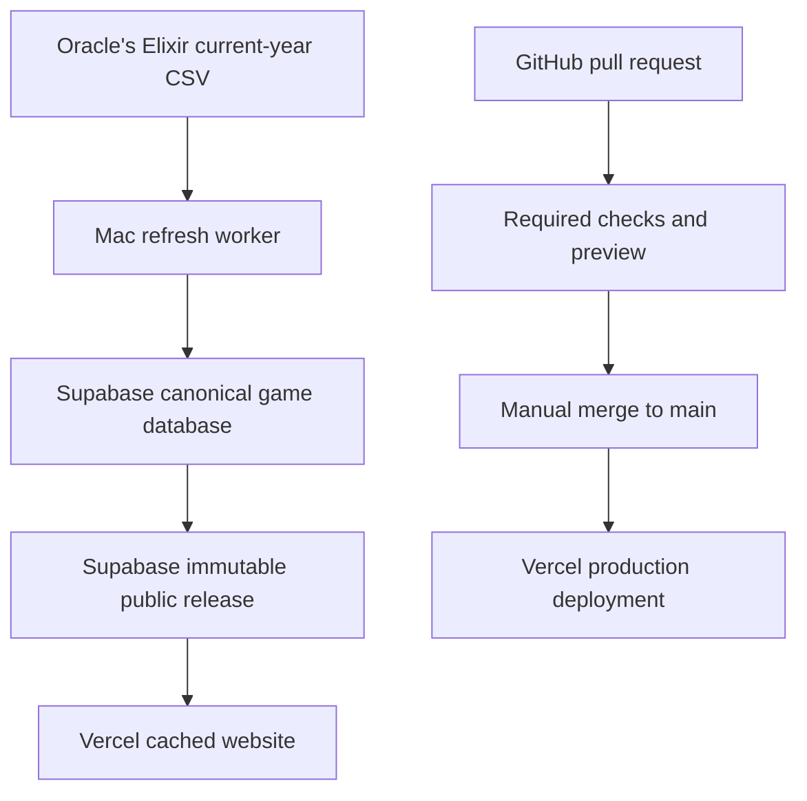

# Scryglass public architecture

This document defines the public code path and data path. The two paths stay separate.

## Target system

A data refresh does not start a Vercel deployment. A code deployment does not acquire OE data.

## Ownership

| System | Owns | Must not own |
| --- | --- | --- |
| GitHub | Source code, migrations, tests, required checks, merge history | OE files, generated releases, production secrets |
| Mac worker | OE acquisition, source validation, derivation, release staging, activation, smoke checks, backups | Public request serving, schema changes outside committed migrations |
| Supabase | Canonical game versions, current game pointers, import receipts, refresh ledger, immutable releases, active release pointer | Code builds, OE downloads |
| Vercel | Next.js build, preview, production server, release-pinned cache | Canonical game data, data derivation, service-role credentials |

## Public source map

| Public surface | Supabase source | Worker source |
| --- | --- | --- |
| `/elo` and rating profiles | Active release manifest plus `features/ratings_snapshot.json`, player rating files, record files, metadata, and weekly ranks | Accepted OE snapshot |
| `/matches` and match profiles | Active release `features/match_index.json`, `features/match_records_2025.json`, and `features/match_records_2026.json` | The same accepted OE snapshot used for ratings |
| `/tiers` | Active release `rankings/tierlists-latest.json` | Patch-wide tier derivation from the accepted OE snapshot |
| `/api/public-data/tierlists` | Active release tier asset | None at request time |
| `/api/health` | Active release manifest and sanitized public refresh health | Latest completed refresh receipt |
| Static team marks and player portraits | Versioned files in `apps/scryglass/public` | Identity build committed through GitHub |

The browser receives only the active public release and the sanitized health record. Private OE rows, game versions, imports, and refresh runs stay private.

Production requests use Supabase only. The repository pack supports local
development and build-time rendering. Vercel Blob is not part of the release
path.

## Credentials

| Credential | Owner | Storage | Use |
| --- | --- | --- | --- |
| Supabase secret key | Mac worker | macOS Keychain | Ingest, stage, activate, restore, and write health |
| Data publication token | Mac worker and Vercel | Keychain on the Mac; protected Vercel variable | Invalidate the active manifest cache after activation |
| Supabase publishable key | Vercel | Protected project variable | Read active public rows and assets |
| GitHub credential | Developer workstation | GitHub CLI credential store | Push branches, open pull requests, and merge after checks pass |
| Vercel credential | Developer workstation | Vercel CLI credential store | Inspect previews, deployments, and runtime errors |

Vercel does not need a database password, a service-role key, or an OE key for normal public requests.

## Schedule and failure policy

The Mac starts one refresh at 00:00, 06:00, 12:00, and 18:00 in `America/Sao_Paulo`. A local exclusive lock rejects overlap. Each stage writes a receipt. A receipt is reusable only when its input fingerprint, transform version, and worker commit match.

The worker keeps the previous active release when acquisition, validation, derivation, upload, readback, activation, cache invalidation, or smoke testing fails. Quarantined games receive a bounded reason and return for review during a later cycle.

Every cycle has one directory under `runtime/data/lol/runtime/cycles`. It contains the accepted source receipt and import receipt. A retry can reuse them only during the same six-hour cycle and only with the same worker commit. Stage receipts record wall time, CPU time, byte counts, row counts, and changed-game counts.

The worker reads all staged assets before it activates a release. Local retention keeps the active release and two previous releases. A separate daily job keeps seven daily database dumps and four weekly dumps.

## Baseline recorded on 11 August 2026

| Item | Recorded value |
| --- | --- |
| GitHub `origin/main` | `ac9f94d38104774a2d1b3e0342011dff92da6b62` |
| Mac worker commit | `ac9f94d38104774a2d1b3e0342011dff92da6b62` |
| Vercel production commit | `ac9f94d38104774a2d1b3e0342011dff92da6b62` |
| Active Supabase release | `v2026.08.11.133311` |
| Public source watermark | `2026-08-11T10:50:41Z` |
| Mac schedule | Every six hours |
| Live migration history | Empty before repair |
| Supabase schema | Public releases, public assets, OE versions, OE current pointers, and OE imports exist |
| Known worker failure | Tier asset Storage readback failed after staging |

The repository migrations through `20260811165241` match the live table set and the latest tier asset constraint. Their live history entries need repair before the refresh-ledger migration is applied.

## Release rules

1. Schema changes use committed Supabase migrations.
2. A pull request needs the application check, rankings-data check, and Vercel preview check.
3. A person merges the current green head commit.
4. Production must use that merged Git commit.
5. A data release activates only after every declared asset passes size, hash, JSON, metadata, and Storage readback checks.
6. Rollback restores an immutable Supabase release. Code rollback promotes the previous READY Vercel deployment.
7. Cache invalidation names the activated release and Vercel returns the release it serves.
